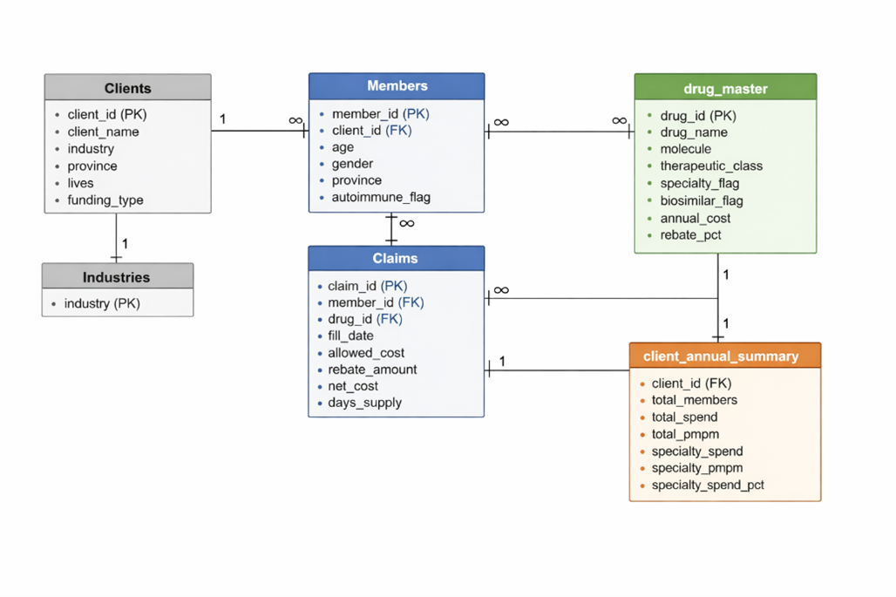
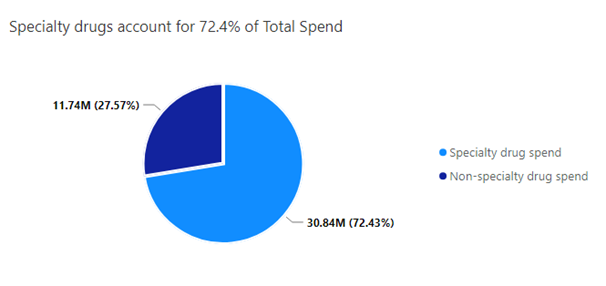
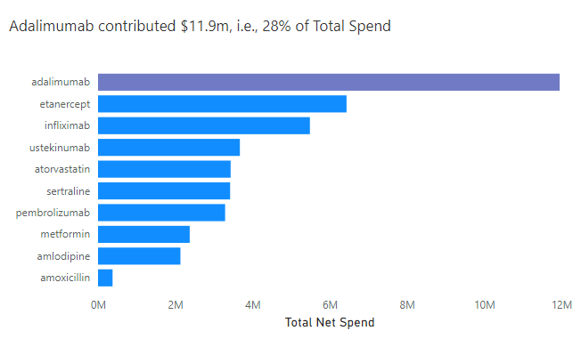
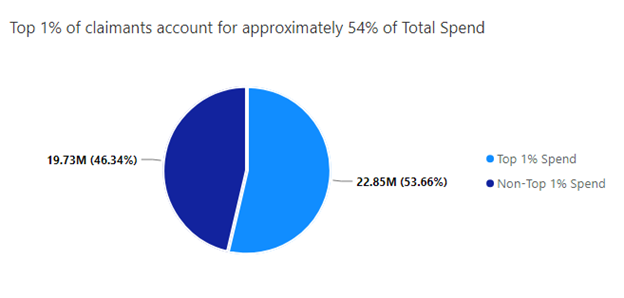
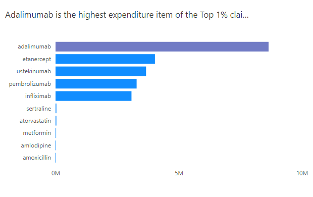
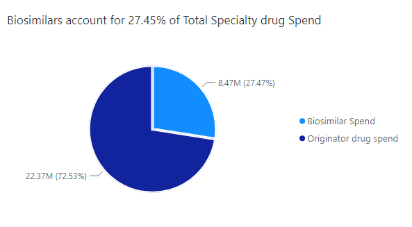
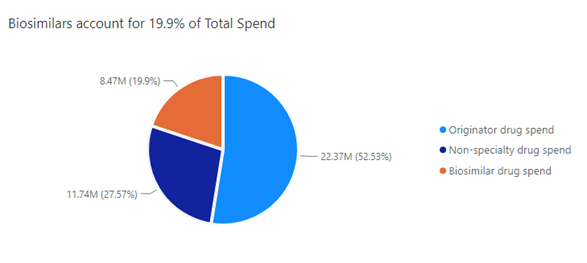
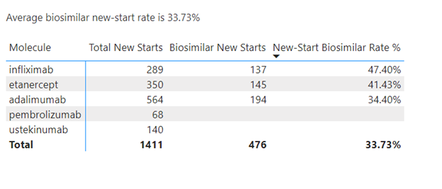
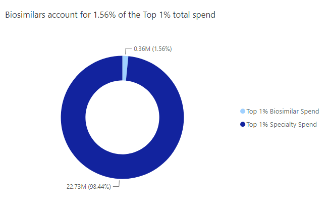

# pbm-specialty-cost-drivers-and-biosimilar-adoption-analytics
This is an analysis of pharmacy claims data to identify specialty drug cost drivers, quantify high-cost claimant concentration, and evaluate biosimilar adoption.

## BUSINESS CONTEXT ##

RADILAN, a pharmacy benefits manager established in 2022, seeks to make sense of its data on originator biologics and the biosimilars that have trailed them. It has made recent efforts to ensure the increasing adoption of biosimilars as replacement for originator specialty drugs, hence, the company executives especially the chief financial officer and the director of clinical operations would like to receive feedback on how well the company's biosimilar adoption interventions have fared and gain clarity regarding future measures that may be required. Therefore, they seek to understand the biosimilar adoption rate, the new-start biosimilar adoption rate, molecules that bear most of the expenditure among other requirements and to get answers to the following questions:

- how well are prescribers doing with putting members on biosimilars when they start therapy?

- are physicians still initiating originators?

- how much of the total specialty drug spend can be attributed to biosimilars?

- are our high cost claimants being progressively switched to biosimilars from originator biologics?

## DATA STRUCTURE ##

The RADILAN claims dataset covers only the year 2024, so it’s focused on intra-year trends and cross-sectional analysis, including month-over-month variation, cost concentration and biosimilar adoption/penetration patterns. In summary, the dataset has a total count of approximately 587,000 claims, 42,238 distinct members and 30 clients from 10 industries.

See an overview of the data dictionary in this [README.md](data_dictionary/README.md) link while detailed table-level documentation and definitions are available in the [data_dictionary](data_dictionary/) folder.

## Data Access

This project uses a PostgreSQL database. The original dataset is not stored as flat files, but can be recreated using the provided SQL scripts.

RECREATE THE DATABASE
1. Run `/sql/ddl` scripts to create tables
2. Load sample data from `/sql/dml/sample_data.sql`
3. Run `/sql/etl` scripts to generate summary tables

## EXECUTIVE SUMMARY ##

Pharmacy spend is highly concentrated with specialty drugs driving 72.4% of the costs with originator biologics, especially Adalimumab, having a prominent share. While biosimilar adoption or penetration is moderate overall (27.47%) and improving among new starts (33.73%), the top 1% remain concentrated on originator biologics, limiting near term cost savings.

## INSIGHTS DETAIL 

## COST STRUCTURE INSIGHTS (What is driving spend?)

- Fact 1 : Specialty drugs dominate the total spend, accounting for $30.84m of a total of $42.58m, representing 72.4% of total spend.

- Inference: Specialty drugs are a primary cost driver, not traditional retail drugs.

- Fact 2: Spending is heavily concentrated on one molecule- Adalimumab – which has a net spend of $11.9m (~28% of total spend).

- Inference: One molecule acts as a systemic cost driver

## COST CONCENTRATION INSIGHTS (Who is driving spend?) 

- Fact 3: There’s extreme cost concentration in the top 1% who wield 54% ($22.85m) of total spend.

- Inference: Cost risk is highly concentrated in a very small population.

- Fact 4: The top 1% spend is disproportionately tied to specialty molecules. For example, adalimumab alone accounts for $8.6m within the top 1% which has a total spend of $22.85m.

- Inference 1: The same molecules that are driving the total spend are also driving high-cost claimant spend. Therefore, targeted interventions will lead to a high ROI and broad policies will likely be inefficient.

- Inference 2: High-cost members are mostly biologics users.

## BIOSIMILAR ADOPTION INSIGHTS (Are biosimilars increasingly replacing originator biologics?)

- Fact 5: There was moderate overall biosimilar penetration with biosimilars accounting for 27.5% ($8.5m) of total specialty drug spend ($30.84m) and representing 19.9% of total spend. 

- Inference: Biosimilar adoption exists but is not dominant.

- Fact 6: New start biosimilar adoption rate (33.7%) is stronger than overall biosimilar penetration (27.45%).

- Inference: Policies are influencing new prescribing behavior.

- Fact 7: The top 1% is almost entirely originator driven with biosimilars accounting for a minute 1.56% of the total 1% spend.

- Inference: High-cost claimants are not switching.

- Inference Summary

Biosimilar strategies are working at initiation but not at the legacy population level. Since originator biologics are concentrated on high-cost claimants, current savings are limited despite improving new start adoption. In other words:

1. There's a shot vs long term savings gap because new-start savings are not leading to future savings and legacy patients are responsible for the current cost-burden.

2. There’s a high concentration risk in the top 1% of members because they account for 54% of the total spend, hence, financial volatility risk is very high.

3. There is a molecule dependency risk due to a heavy reliance on Adalimumab, therefore, any price shift will impact the entire plan.

## RECOMMENDATIONS ##

1. Since specialty drugs dominate over 70% of total spend, *specialty program management* should be prioritized rather than broad formulary tightening and further, analytics and interventions should be focused on biologics, auto-immune therapies and oncology drugs.

2. To reduce the effects of one molecule acting as a systemic cost driver, create a *molecule-specific strategy* that incorporates a biosimilar-first policy, prior authorization tightening and step therapy protocols. Start with Adalimumab and expand to eternacept and infliximab.

3. To tackle the high cost-concentration in the total spend and in the 1% driven largely by one drug, implement *high-cost claimant management* through case-by-case management, adherence monitoring, therapy optimisation, adherence review and site of care optimization. This can be achieved by identifying 100 -500 members and reviewing their therapy pathways.

4. Target legacy switching (highest ROI):- The focus should be on the top 1% claimants and Adalimumab users. Physicians who prescribe them should be reached out to, mandatory switching should be enforced where applicable, and incentives should be created for switching.

5. Biosimilar-first policy should be strengthened with a goal to increasing new-start rate from 34% to 70% by restricting originator coverage, requiring step therapy and enforcing prior authorization.

6. Client specific targeting:- identify high risk employers, tailor interventions and adjust funding strategy

## ASSUMPTION(S)

All members were eligible for all 12months, i.e., they had an all-year-round enrolment. There was no mid-year add terms and no partial eligibility.
