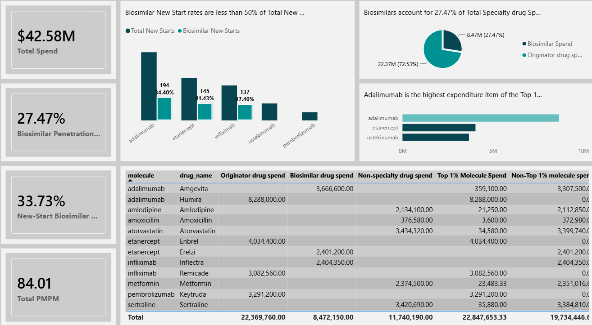

# pbm-specialty-cost-drivers-and-biosimilar-adoption-analytics
SQL and Power BI analysis of pharmacy claims data to identify specialty drug cost drivers, quantify high-cost claimant concentration, and evaluate biosimilar adoption in a simulated PBM setting.
BACKGROUND
REgain, a pharmacy benefits manager established in 2001, seeks to make sense of its data since the advent of originator biologics and the biosimilars that have trailed them. REgain has made recent efforts to ensure the increasing use of biosimilars in the stead of originator specialty drugs and would like to receive feedback on how well their interventions have fared and gain insights regarding further changes that may be required.

DATA STRUCTURE
The dataset covers one year, so it’s focused on intra-year trends and cross-sectional analysis, including month-over-month variation, cost concentration and biosimilar adoption patterns.
The REgain database structure is depicted below having the following tables: claims, clients, drug_master, industries, member_specialty-drug, members, MemberAnnualSpend, client_annual_trend etc.

EXECUTIVE SUMMARY
Pharmacy spend is highly concentrated with specialty drugs driving most of the costs. While biosimilar adoption is moderate overall and improving among new starts, the top 1% remain concentrated on originator biologics, limiting near term cost savings.

INSIGHTS DEEP DIVE
COST STRUCTURE INSIGHTS (What is driving spend?)
Fact 1: Specialty drugs dominate the total spend, accounting for $30.84m of a total of $42.58m, representing 72.4% of total spend.
Inference: Specialty drugs are a primary cost driver, not traditional retail drugs.

Fact 2: Spending is heavily concentrated on one molecule- Adalimumab – which has a net spend of $11.9m (~28% of total spend).
Inference: One molecule acts as a systemic cost driver

COST CONCENTRATION INSIGHTS (Who is driving spend?)
Fact 3: There’s extreme (greater than normal) cost concentration in the top 1% who wield 54% ($22.85m) of total spend.
Inference: Cost risk is highly concentrated in a very small population.

Fact 4: The top 1% spend is disproportionately tied to specialty molecules. For example, adalimumab accounts for $8.6m alone within the top 1% which has a total of $22.85m.
Inference 1: The same molecules that are driving the total spend are also driving high-cost claimant spend. Therefore, targeted interventions will lead to a high ROI and broad policies will be inefficient.
Inference 2: High-cost members are chronic biologics users and long-term therapy patients.

BIOSIMILAR ADOPTION INSIGHTS (Are biosimilars increasingly replacing originator biologics?)
Fact 5: There was moderate overall biosimilar adoption with biosimilars accounting for 27.5% ($8.5m) of total specialty drug spend ($30.84m) representing 19.9% of total spend. Inference: Biosimilar adoption exists but is not dominant.
Fact 6: New start biosimilar adoption rate (33.7%) is stronger than overall biosimilar penetration (27.5%).
Inference: Policies are influencing new prescribing behavior.

Fact 7: The top 1% is almost entirely originator driven with biosimilars accounting for a minute 1.56% of the total 1% spend.
Inference: High-cost claimants are not switching.

Inference Summary

Biosimilar strategies are working at initiation but not at the legacy population level. Since originator biologics are concentrated on high-cost claimants, current savings are limited despite improving new start adoption. In other words,

Theres a shot vs long term savings gap because new-start savings are not leading to future savings and legacy patients are responsible for the current cost-burden.
There’s a high concentration risk in the top 1% of members because they account for 54% of the total spend, hence, financial volatility risk is very high.
There is a molecule dependency risk due to a heavy reliance on Adalimumab, therefore, any price shift will impact the entire plan
RECOMMENDATIONS

Since specialty drugs dominate over 70% of total spend, specialty program management should be prioritized rather than broad formulary tightening. Further, analytics and interventions should be focused on biologics, auto-immune therapies and oncology.

To reduce the effects of one molecule acting as a systemic cost driver, create a molecule-specific strategy that incorporates a biosimilar-first policy, prior authorization tightening and step therapy protocols.

To tackle the high cost-concentration in the total spend and in the 1% driven largely by one drug, implement high-cost claimant management through case-by-case management; adherence monitoring; and site of care optimization. This can be achieved by identifying 100 -500 members and reviewing their therapy pathways.

Target legacy switching (highest ROI):- The focus should be on the top 1% claimants and Adalimumab users. Physicians who prescribe them should be reached out to; mandatory switching should be enforced where applicable; and incentives should be created for switching.

Biosimilar-first policy should be strengthened with a goal to increasing new-start rate from 34% to 70% by restricting originator coverage; require step therapy; and enforce prior authorization.

Focus on high-cost claimant management for members >$50k/year through case management, therapy optimization and adherence review

Implement molecule-level strategy: - start with Adalimumab, expand to eternacept and infliximab

Client specific targeting: - identify high risk employers; tailor interventions; and adjust funding strategy

ASSUMPTION(S)
All members were eligible for all 12months, i.e., they had an all-year-round enrolment. There was no mid-year add terms and no partial eligibility.
